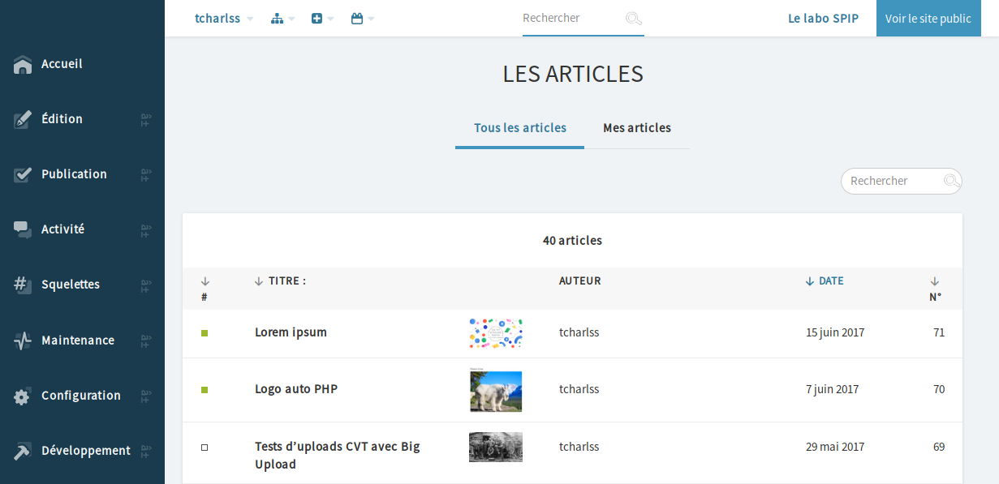

# Griseus 2000

> Ce plugin est en plein développement. Il s'agit d'une expérimentation qui débouchera peut-être sur quelque chose d'utilisable, ou peut-être pas. Peu importe, il s'agit avant tout de tester des idées.
>
> Il a été commencé en catimini dans un coin, mais toutes les contributions sont les bienvenues :)



Griseus 2000 est un thème pour l'espace privé de SPIP 3.1+

Quelques objectifs parmis d'autres :

* Avoir une interface sobre et lisible
* Simplifier des choses
* Utiliser au mieux la largeur disponible
* Un graphisme « moderne » avec quand même une touche personnelle à la SPIP
* Reprendre les bonnes idées qui marchent sur d'autres interfaces (de CMS, mais pas que)
* S'autoriser à expérimenter des choses modernes (svg, flex, grid, variables CSS, etc.)
* Être utilisable sur tablettes et mobiles

## Compilation

Le thème est développé en SCSS et se compile au moyen de [Gulp](https://gulpjs.com/), un automatiseur de tâches.

Les sources se trouvent dans `prive/themes/griseus2000/scss`, et la CSS est compilée dans `prive/themes/griseus2000/css`.

La compilation s'effectue depuis le dossier `prive/themes/griseus2000`.

La première fois, installer les dépendances localement avec la commande `npm install`.

Pour surveiller les changements des fichiers sources et lancer la compilation automatiquement, utiliser la commande `gulp watch`.

La compilation lance les tâches suivantes, qu'on peut également lancer individuellement si besoin :

* `gulp sass` : compiler la CSS
* `gulp css` : traiter la CSS compilée -> ajouter les préfixes navigateurs, retirer les commentaires, embarquer certaines ressources en base64, formater le code
* `gulp minify` : minifier la CSS compilée
* `gulp fontello` : télécharger les sources de la fontface des icônes dans un dossier temporaire scss/fontello_tmp

## Fichiers du thème

La feuille de style principale est un squelette CSS : `style_prive_css.html`

Ce squelette inclus d'autres fichiers dans un ordre précis :

1. Quelques squelettes CSS nécessaires : `picker.css`, `jquery-ui.css`, `exceptions.css`
2. Les icônes des bandeaux : code généré via une fonction
3. Les variables de couleurs : `css/variables.css.hml`
4. **La CSS principale du thème : `css/theme.css`**
5. Les styles nécessitant un chemin vers une ressource (images, polices, etc.) : `css/ressources.css.html`
6. Les squelettes CSS des plugins : `style_prive_plugin_[plugin].css.html`

## Charte / démo

Une page dans l'espace privé présente les généralités du thème `?exec=griseus2000`

## Règles de codage SCSS et choses à savoir

### Unité de base

L'unité de base est la variable `$bs`, raccourci pour « base spacing ». Elle correspond à une hauteur de ligne. Pour définir des marges, des paddings, ou même des dimensions il est très recommander de s'en servir.

L'utiliser pour des marges inférieures ou des hauteurs permet d'avoir un rythme vertical harmonieux par exemple.

````
.truc { margin-bottom: $bs*2 } <!-- oui -->
.truc { margin-bottom: 2em } : <!-- non ! -->
````

### Chemin des images et autres ressources

Tous les styles qui ont besoin d'un chemin vers une ressource avec `url()` et `src()` doivent être placés dans `css/ressources.css.html`, puisqu'on doit utiliser la balise `#CHEMIN`.

### Icônes

Les icônes génériques viennent pour la plupart d'une police fontface obtenue depuis fontello.com.
La liste est consultable dans la charte et dans `scss/modules/icons-codes.scss`.

Pour ajouter une icône à un item par exemple :
````
.item {
  @extend .icon;
  @extend .icon-truc;
}
````

Pour ajouter des icônes :

1. se rendre sur fontello.com
2. importer `fontello-config.json`
3. sélectionner les icônes supplémentaires
4. télécharger `fontello-config.json`
5. télécharger la police avec la commande `gulp fontello`
6. renommer et déplacer les fichiers de la police et le code des icones depuis `scss/fontello-tmp` vers `scss/modules/icons-codes.scss` et `polices/icons/icons.woff` (ce n'est pas encore automatisé)

Dans les cas où il n'est pas possible d'utiliser cette police, il y a quelques svg dans /images.

### Classes virtuelles

Certaines classes préfixées par `gr-` sont des classes « virtuelles » qui servent uniquement à étendre les vraies classes de SPIP. Elles ne sont pas utilisées directement dans les squelettes de SPIP.

Par exemple, la classe `.gr-card` est utilisée pour étendre les listes d'objets, les boîtes, les formulaires... (et obtenir donc des choses uniformes).

````
.formulaire_spip {
  @extend .gr-card;
}
````